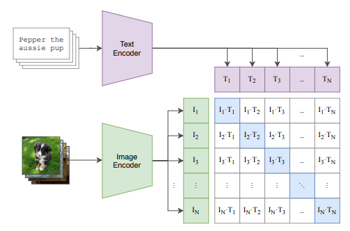
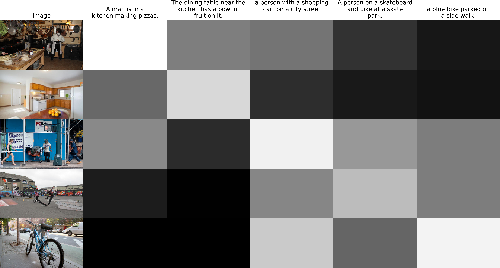

# Text-Guided Image Finder

# Description:

The Text-Guided Image Finder is an application that leverages cutting-edge techniques in artificial intelligence to enable users to search for images based on textual descriptions. This project integrates the structure of CLIP (Contrastive Language-Image Pre-training)[1] and utilizes DistilBERT[2] as the text encoder along with EfficientNet[3] as the image encoder. Trained on the image from COCO 2017 dataset[0] with text annotation from [hugging face](https://huggingface.co/datasets/phiyodr/coco2017), this application learns to understand the nuanced relationships between text and images, providing accurate and meaningful results.

# Contrastive Language-Image Pre-training(CLIP)

Image from Radford, Alec, et al. "Learning transferable visual models from natural language supervision." *International conference on machine learning*. PMLR, 2021.

As demonstrated in the paper [CLIP](https://arxiv.org/pdf/2103.00020.pdf), it achieves the objective of pairing given text and images by learning a multi-modal embedding space. This approach applies contrastive representation learning to compare the similarity between images and sets of text. It trains both a text encoder and an image encoder to maximize the cosine similarity of the image and text embeddings for the $N$correct pairs in the batch, while simultaneously minimizing the similarity for $N^2 - N$ incorrect pairs. Optimization is performed using symmetric cross-entropy for the similarity loss.

In our application, we utilize EfficientNetB0 as the image encoder and DistilBERT as the text encoder. For the image encoder, global average pooling is replaced with an attention pooling mechanism. Concerning the text encoder, its output is initially passed through layer normalization, after that, only the End of Text (EOT) of each is kept as output, as it is deemed to contain the most information.

Following this, both the feature-extracted image encoder and text encoder are passed through a projector. This component takes either the text encoder's output or the image encoder's output and subjects it to a linear function, projecting the output into a shared embedding space. Subsequently, L2 normalization is applied, dividing each value by the square root of the squared sum of its channels.

Next, the dot product of the image encoder and text encoder is calculated and multiplied by the exponential of a trainable weight called temperature. This method is applied because CLIP passes logits to the cross-entropy loss. During projection, when values undergo L2 normalization, the dot product is confined to the range of -1 to 1. This limitation in dynamic range may restrict the categorical probability distribution that the logits can represent.

The model's output is an $N\times N$ array representing the correlation between the given image and text. Higher values indicate greater similarity between the depicted image and the represented text, while lower values signify lesser similarity.

### Attention Pooling

The output of the image encoder is( $N \times H \times W \times  C)$ reshaped to$N \times ( H \times W) \times C$. Subsequently, global average pooling is applied, resulting in a sequence of shape ($N\times1 \times C)$. This sequence is then merged with the reshaped output sequence of the image encoder, resulting in an output of shape  $N \times  (1  + H\times W ) \times C$. Positional encoding is then added to this output. Following that, multi-head attention is applied, where the query of attention is the result of the first sequence of the segment, which is also the sum of mean of the segment and positional encoding, while the key of the attention is the sum of the positional encoding and the mean merged with the entire segment($N \times (1 + H \times W ) \times C)$.

### Loss:

Given that CLIP utilizes contrastive representation learning, it produces an $N\times N$ array as its output. This signifies that if we designate $i$ as the index of the matrix, it becomes obvious that every $(i,i)$ is correct pair, while all other pairs are incorrect. To formulate labels for loss calculation, we simply generate a list ranging from 0 to $N-1$, where the $i_{th}$ element of each $\text{prediction}_i$ corresponds to the correct prediction. The loss for the text encoder is computed using cross-entropy along axis 0 of the matrix, while for the image encoder, it is calculated along axis 1. The overall model loss is then determined as the mean of these two losses.

# Result:

The following presents the prediction results on the COCO 2017 validation dataset. It is evident that the model excels in identifying correct data pairs, as indicated by darker shades correlating with smaller values. This capability holds particular significance in zero-shot learning applications. Leveraging CLIP, the need for further training when introducing new classes or unseen objects may be eliminated. By providing a textual description of the object, the model accurately retrieves the corresponding image, thereby enhancing its efficacy in zero-shot learning scenarios.

[0] Lin, Tsung-Yi, et al. "Microsoft coco: Common objects in context." *Computer Vision–ECCV 2014: 13th European Conference, Zurich, Switzerland, September 6-12, 2014, Proceedings, Part V 13*. Springer International Publishing, 2014.

[1] Radford, Alec, et al. "Learning transferable visual models from natural language supervision." *International conference on machine learning*. PMLR, 2021.

[2] Sanh, Victor, et al. "DistilBERT, a distilled version of BERT: smaller, faster, cheaper and lighter." *arXiv preprint arXiv:1910.01108* (2019).

[3] Tan, Mingxing, and Quoc Le. "Efficientnet: Rethinking model scaling for convolutional neural networks." *International conference on machine learning*. PMLR, 2019.
